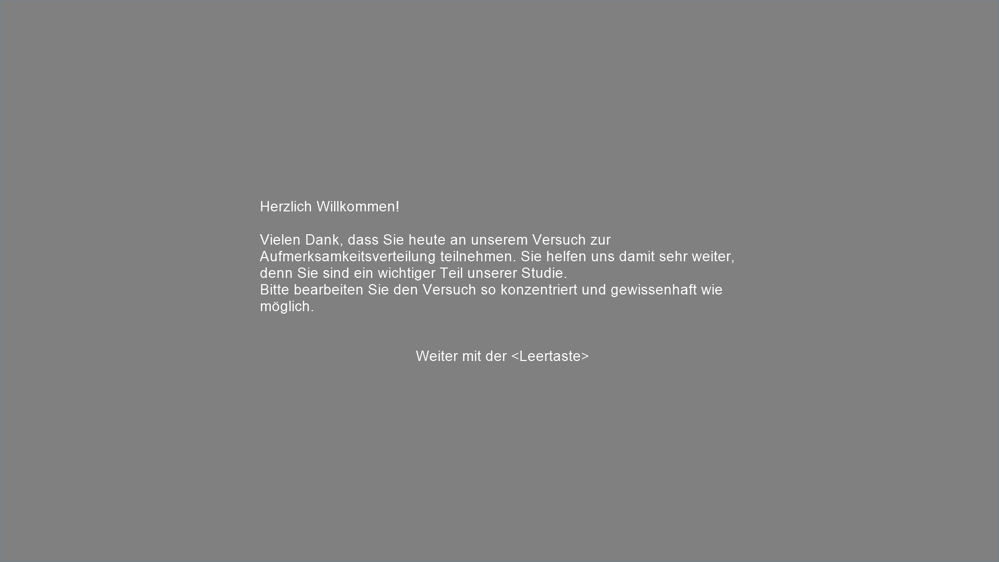

letzte Aktualisierung: `r format(Sys.time())`

## Vorbereitung
-   Stromleiste am PC hinter der Kammer anschalten
    -   Lüfter drehen kurz auf
-   beide PCs hochfahren
    -   auf dem linken PC läuft der Eyetracker und die Aufzeichnung der Eyetracking-Daten
    -   auf dem rechten PC läuft das Experiment (Präsentation der Stimuli) und die Aufzeichnung der Reaktionszeiten
        -   Benutzername: Stimulation
        -   Passwort: Mesa2014
-   Stromleiste, Licht und Lüftung in der Kabine einschalten
-   **a)** über die GUI
    -   PsychoPy2 auf dem Desktop des rechten PC mit Doppelklick auf  öffnen
    -   Datei öffnen (falls noch nicht geöffnet)  
    
        -   über *Open recent* (s.o.)
        -   über *Open...* die Datei "mGCP-III-et**.py**" öffnen
    -   Datei mit Klick auf  ausführen
-   **b)** über die Kommandozeile
    -   Zum Experiment Ordner "mGCP-III-et" navigieren
    -   Rechtsklick im Ordner, in dem die Datei "mGCP-III-et.py" liegt, und "Git Bash here" anklicken  
      
        -   Öffnet ein Terminal am angegebenen Pfad
    -   Befehlt "psypy mGCPT-III-et.py" eingeben  
      
        -   *psypy* ist ein Link (genauer:  Alias für den Pfad) zum Program PsychoPy2
        -   Das Arguemnt *mGCP-III-et.py* wird mit dem verlinkten Programm ausgeführt
    -   Mit *Enter* Datei ausführen
-   Probandennummer bei *subject* eintragen  
  
    -   Beginnend mit 0 bei 1-9: 01, 02, ...  
-   Mit *OK* Experiment starten
-   Blanko Bildschirm erscheint auf dem Bildschirm in der Kabine  

## Vor dem Experiment

### Proband begrüßen
-   Instruktion: „Hallo und herzlich Willkommen zu unserer Studie. Wir freuen uns, dass Sie sich zur Teilnahme bereit erklärt haben.“
-   „Untersuchung läuft“ Schild an die Türe hängen

### Probandeninformation und Einwilligungserklärung
-   austeilen und unterschreiben lassen
    -   falls Proband Fragen hat, diese beantworten):
-   Instruktion: „Bevor wir mit dem Experiment beginnen, teile ich Ihnen eine Probandeninformation aus, auf der Sie Informationen zum Ablauf der Studie finden. Ich bitte Sie, die Informationen aufmerksam durchzulesen und sich bei weiteren Fragen zu melden. Wenn Sie alles durchgelesen und verstanden haben, können Sie dies mit Ihrer Unterschrift auf der Einwilligungserklärung bestätigen.“
    -   eventuell Probandeninformation mündlich zusammenfassen
-   im Falle einer Nachfrage, weshalb die Adresse angegeben werden muss darauf hinweisen, dass aufgrund fehlender Probandennummer sowieso keine Zuordnung erfolgen kann und Anonymität garantiert ist.
-   Einwilligungserklärung in Ordner abheften

### Voraussetzungen
-   KEIN Augen-Makeup!
    -   Notfalls abschminken lassen.
-   Brille?!

### Experiment starten
-   Mit *Leertaste* auf der rechten Tastatur die Instruktionen aufrufen
  
-   Proband Instruktionen durchlesen lassen

      

    

    

    

### Eyetracker einstellen
-   Sobald die Kalibrierungsinstruktion erscheint kann mit der Kalibrierung gestartet werden.
-   Zuerst das Kamerabild auf den Bildschirm in der Kabine übertragen mit:
    -   **a)** *Enter* auf der rechten Tastatur, oder der Tastatur in der Kabine
    -   **b)** Über den Button FOLGT

### Hinweise an Probanden vor der Kalibrierung
-   Lieber ein bisschen länger als zu kurz auf die einzelnen Fixationspunkte schauen
-   Den Kopf nach Kalibrierung nicht mehr bewegen
-   Nachfragen ob soweit alles verstanden wurde
-   Türen lassen sich nicht verriegeln und von innen öffnen
-   Sobald die Kalibrierung abgeschlossen ist, kann selbstständig das Experiment gestartet/ fortgesetzt werden

### Vor der Kalibrierung
-   Tischhöhe für Probanden angenehm einstellen
    -   **NICHT** den Stuhl oder den Eyetracker verstellen
-   **Schärfe** am Eyetracker einstellen
    -   Mit dem Hebel rechts am Tracker den türkisfarbenen Punkt in Pupille möglichst minimieren
-   **Threshold** der Software einstellen
    -   Pfeiltaste links: Bildschirm wechselt von Auge auf Darstellung des gesamten Gesichts
    -   *a* drücken für Autothreshold
    -   Falls Pupille mit Lid verschwimmt, über Pfeiltasten hoch/runter Threshold manuell einstellen

### Kalibrierung
-   Türen der Kabine schließen
    -   Bis zum Ende des Blocks nicht mehr öffnen
-   Am PC in Eyelink auf *Kalibrieren* klicken
-   Auf Autotrigger klicken
-   Sind die entstehenden Kreuze in ordentlichen spalten > accept, wenn nicht nochmal kalibrieren
-   Validierung
-   Auf Validierung klicken
-   Auf Auto trigger klicken
-   Wenn unten rechts in Klammer „GOOD“ steht, dann Output/Record klicken zum Starten des Experiments  
-   Instruktion erscheint auf dem Bildschirm des Probanden  
  

-   Der Block beginnt mit dem ersten Trialcounter  

## Während des Experiments
-   Signal beobachten: während den ersten beiden Spalten (VP sieht Fixationskreuz) sollten die beiden Linien parallel sein
    -   Entspricht der Baseline Messung
    -   Rote Balken sind Blinzler
-   Blockende abwarten  
  
    -   Trialcounter beachten  
  
        -   Trial 96 ist der letzte Trial in Block 1
        -   Trial 192  ist der letzte Trial in Block 2
        -   Trial 288 ist der letzte Trial in Block 3
        -   Trial 384 ist der letzte Trial im Block 4
-   Zwischen den Blöcken, vor jeder Neukalibrierung auch Autothreshold neu bestimmen

## Nach dem Experiment
-   Daten transferieren
    -   FOLGT
-   Checken ob Daten vorhanden und ausreichend groß

## Probleme und deren Bewältigung

### Datenverlust
Datenverlust ist quasi **nicht** möglich. Die Daten werden fortlaufend aufgezeichnet, selbst wenn der PC unmittelbar ausgeht, sollten die Daten weiterhin vorhanden sein, solange der Rechner danach wieder normal hochfährt.

### Eyetracker Neustart
FOLGT

### Experiment neustarten
Das Experiment kann jederzeit an jedem beliebigen Block neugestartet werden. Dazu trägt man im ersten Dialogfenster unter *block* den Block ein, andem das Experiment wieder starten soll.
Bei einem Absturz oder einer Unterbrechung **immer mit dem nächsten Block beginnen**.
