letzte Aktualisierung: `r format(Sys.time())`

<!-- Color for the frames for the screenshots: #708090 -->

## Vorbereitung {#vorbereitung}

### Stromeinschalten
-   Steckereiste hinter der Kammer (hinter dem rechten Bildschirm) anschalten
    -   Lüfter drehen kurz auf
- Steckerleiste, Licht und Lüftung in der Kabine einschalten
    -   Lüftung so neidrig drehen, dass die in der Kabine nicht (schwach) hörbar ist


### PCs hochfahren
-   auf dem linken PC läuft der Eyetracker, daher im folgenden *Eyetracker-PC* und die Aufzeichnung der Eyetracking-Daten
-   auf dem rechten PC läuft das Experiment (Präsentation der Stimuli), daher im folgenden *Experiment-PC* und die Aufzeichnung der Reaktionszeiten  
    -   Benutzername: Stimulation
    -   Passwort: *bekannt*

### PsychoPy starten

#### ~~**a)** über die GUI~~
-   ~~PsychoPy2 auf dem Desktop des Experiment-PC mit Doppelklick auf  öffnen~~
-   ~~Datei öffnen (falls noch nicht geöffnet)~~  
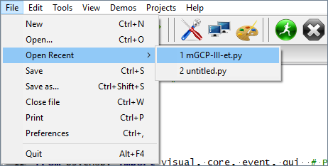
    -   ~~über *Open recent* (s.o.)~~
    -   ~~über *Open...* die Datei "mGCP-III-et**.py**" öffnen~~
-   ~~Datei mit Klick auf  ausführen~~

#### **b)** über die Kommandozeile
-   Zum Ordner "C:\\Users\\Public\\Documents\\Projects\\jonas\\mGCPT-III-et\\experiment\" mit dem Experiment navigieren
-   Rechtsklick im Ordner, in dem die Datei "mGCP-III-et.py" liegt, und "Git Bash here" anklicken  
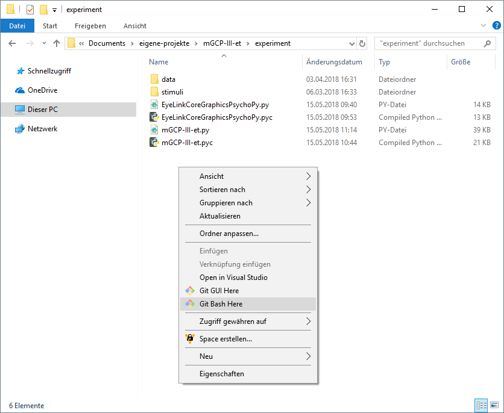  
    -   Öffnet ein Terminal am angegebenen Pfad
-   Befehl "psypy mGCP-III-et.py" eingeben  
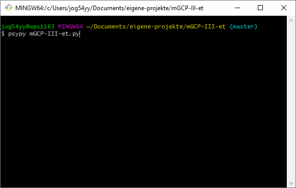  
    -   Tipp: mit dem *Tabulator* könnt ihr automatisch das geschriebene Vervollstädnigen: 
        -   ps + *Tab* wird zu psypy
        -   mg + *Tab* wird dann zu "mGCP-III-et." (**Dateiendung beachten**)
    -   *psypy* ist ein Link (genauer:  Alias für den Pfad) zum Program PsychoPy2
    -   Das Argument *mGCP-III-et.py* wird mit dem verlinkten Programm ausgeführt
-   Mit *Enter* Datei ausführen

### Probandennummer eintragen {#probandennummer}  
-   *block* sollte unverändert bleiben (ggfs. siehe [Experiment neustarten](#experimentneustart))
-   Probandennummern beginnen mit 0 bei 1-9: 01, 02, ... bei *subject* eintragen  
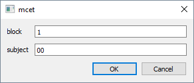
    -   Probandennummern dürfen ausschließlich die Ziffern 0-9 enthalten und **keine** Buchstaben oder Sonderzeichen (inkl. Leerzeichen)
-   Mit *OK* Experiment starten  
-   Blanko Display erscheint auf dem Experiment-Bildschirm in der Kabine  
    
-   Eyetracker-Bildschirm, nach dem Hochfahren  
    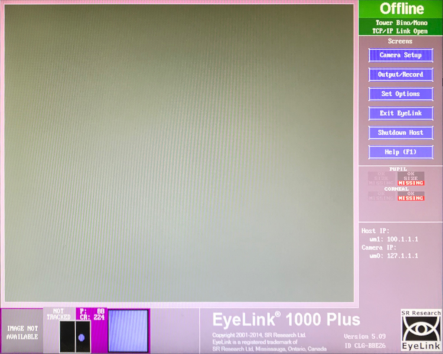
-   Eyetracker-Bildschirm, nach Start von "mGCP-III-et.py"  
    FOLGT

### Materialien vorbereiten
-   Fragebögen, Probandeninformation und Einverständiserklärung rauslegen
-   **ausschließlich** Fragebögen mit Probandennummer beschriften

## Vor dem Experiment

### Proband begrüßen
-   Instruktion: „Hallo und herzlich Willkommen zu unserer Studie. Wir freuen uns, dass Sie sich zur Teilnahme bereit erklärt haben.“
-   „Untersuchung läuft“ Schild an die Türe hängen

### Probandeninformation und Einwilligungserklärung
-   Austeilen und unterschreiben lassen
    -   Ggfs. Fragen beantworten
-   Instruktion: „Bevor wir mit dem Experiment beginnen, teile ich Ihnen eine Probandeninformation aus, auf der Sie Informationen zum Ablauf der Studie finden. Ich bitte Sie, die Informationen aufmerksam durchzulesen und sich bei weiteren Fragen zu melden. Wenn Sie alles durchgelesen und verstanden haben, können Sie dies mit Ihrer Unterschrift auf der Einwilligungserklärung bestätigen.“
    -   Ggfs. Probandeninformation mündlich zusammenfassen
-   im Falle einer Nachfrage, weshalb die Adresse angegeben werden muss darauf hinweisen, dass aufgrund fehlender Probandennummer sowieso keine Zuordnung erfolgen kann und Anonymität garantiert ist.
-   Einwilligungserklärung in Ordner abheften
-   Probandennummer in die Probandenliste eintragen

### Voraussetzungen
-   KEIN Augen-Makeup!
    -   Ggfs. abschminken lassen.
-   Brille?!

### Sitzposition
-   Tischhöhe für Probanden angenehm einstellen
    -   **NICHT** den Stuhl oder den Eyetracker verstellen
    -   ggf. Kinnstütze anpassen
-   Porband muss den ganzen Bildschirm sehen können

### Experiment starten
-   Mit *Leertaste* auf der Experiment-Tastatur die Instruktionen aufrufen
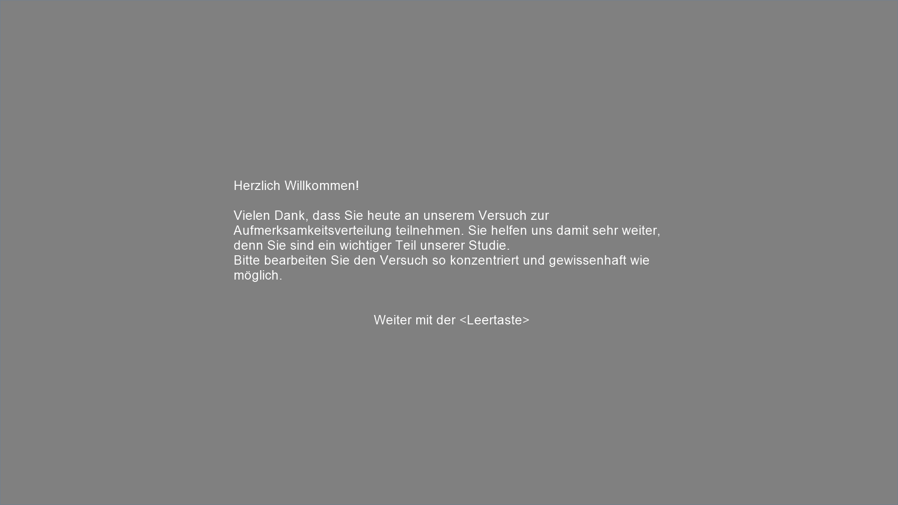  
-   Proband Instruktionen durchlesen lassen

    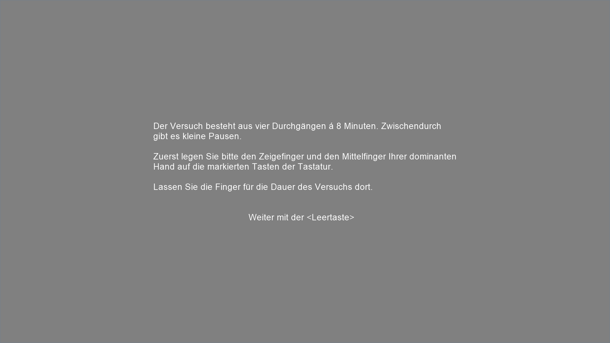  

    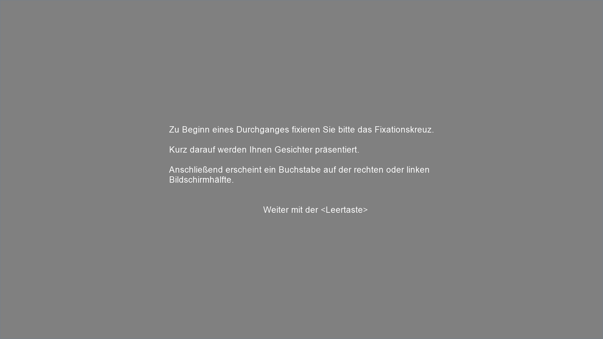

    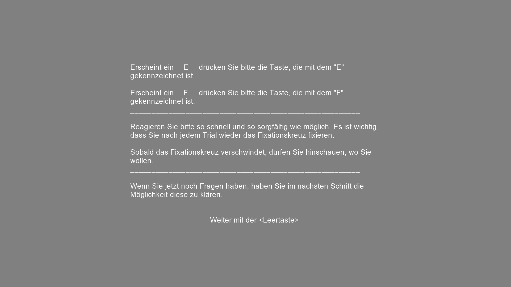

    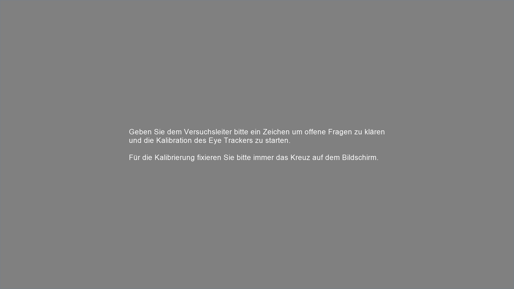

### Eyetracker einstellen
-   Sobald die Kalibrierungsinstruktion erscheint kann mit der Einstellung des Eyetrackers gestartet werden
-   Zuerst das Kamerabild auf den Bildschirm in der Kabine übertragen mit
    -   **a)** über den Button  auf dem Eyetracker-PC
    -   **b)** *Enter* auf der Experiment-Tastatur

### Hinweise an Probanden
-   Vor der Kalibrierung:
    -   Lieber ein bisschen länger als zu kurz auf die einzelnen Fixationspunkte schauen
    -   Den Kopf nach Kalibrierung ambesten nicht mehr bewegen
    -   Nachfragen ob soweit alles verstanden wurde
    -   Türen lassen sich nicht verriegeln und von innen öffnen
    -   Sobald die Kalibrierung abgeschlossen ist, kann selbstständig das Experiment gestartet/ fortgesetzt werden

### Vor der Kalibrierung
-   **Schärfe** am Eyetracker einstellen
    -   Mit dem Hebel rechts am Tracker den türkisfarbenen Punkt in Pupille möglichst minimieren
-   **Threshold** der Software einstellen
    -   *Pfeiltasten links/rechts* auf der Experiment-Tastatur: Bildschirm wechselt von Auge auf Darstellung des gesamten Gesichts
    -   *a* drücken für Autothreshold
    -   Falls Pupille mit Lid verschwimmt, über *Pfeiltasten hoch/runter* Threshold manuell einstellen
-   beide Türen der Kabine bis zum Ende des Experiments schließen
    -   nur bei Blockende oder im Notfall öffnen

## Während des Experiments

### Kalibrierung & Validierung {#kalibrierung}
-   Türen sind geschlossen
...  
    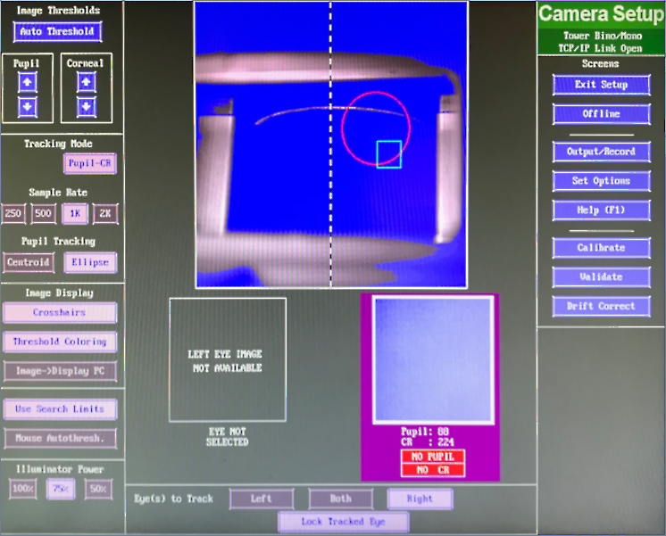
```
##############################################################################
### Eyelink Kamerasetup Anleitung ############################################
##############################################################################

Druecke eine Taste um jetzt in das EyeLink Kamerasetup zu kommen.
Mit 'Enter' das Kamerabild zwischen den Bildschirmen hin- und herschalten.
Mit 'c' in den Kalibrationsmodus bzw. mit 'v' in den Validationsmodus schalten
und mit 'Enter' starten.
Mit 'Escape' Kamerasetup verlassen.

##############################################################################
##############################################################################
##############################################################################
```
#### Kalibrierung starten
-   **a)**  klicken *oder*
-   **b)** *c* auf der Experiment-Tastatur
-   Mit *autotrigger* oder *Enter* die Kalibrierung starten
        -   wenn *autotrigger* nicht startete, dann erneut *auto trigger* klicken
-   Abgebildeten Kreuze in ordentlichen Spalten angeordnet?
    -   Ja: *accept*  
    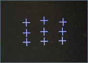
    -   Nein: Erneut kalibrieren

#### Validierung starten
-   **a)**  klicken *oder*
-   **b)** *v* auf der Experiment-Tastatur
-   Mit *autotrigger* oder *Enter* die Kalibrierung starten
    -   wenn *autotrigger* nicht startete, dann FOLGT
-   *RIGHT ERROR*: unter 1 und *GOOD* **und** Abweichunge zu den Punkten <1?
    -   Ja: *accept* klicken  
     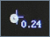
    -   Nein: erneut validieren mit *RESTART*, ggf. *DISCARD* und erneut kalibrieren  
    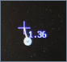

#### Trials starten
-    klicken
-   Instruktion erscheint auf dem Bildschirm in der Kabine und der Proband kann das Experiment selbst starten  
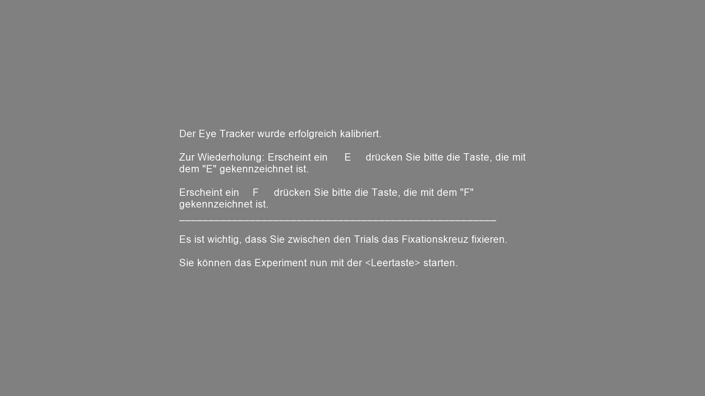  

-   Der Block beginnt mit dem ersten Trial  
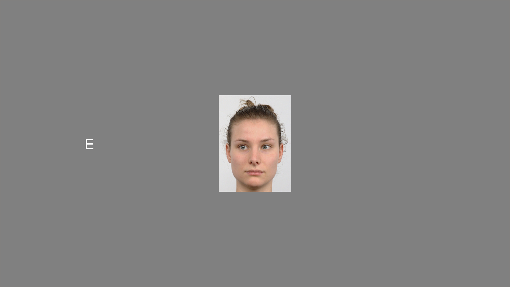

### Signal
-   BESCHREIBUNG FOLGT
-   während den ersten beiden Spalten (Proband sieht Fixationskreuz) sollten die beiden Linien parallel sein
    -   Entspricht der Baseline Messung
    -   Rote Balken sind Blinzler
    
### Kalibrierung zwischen den Blöcken
-   Instruktion für das Ende des Blocks erscheint auf dem Bildschirm in der Kabine  
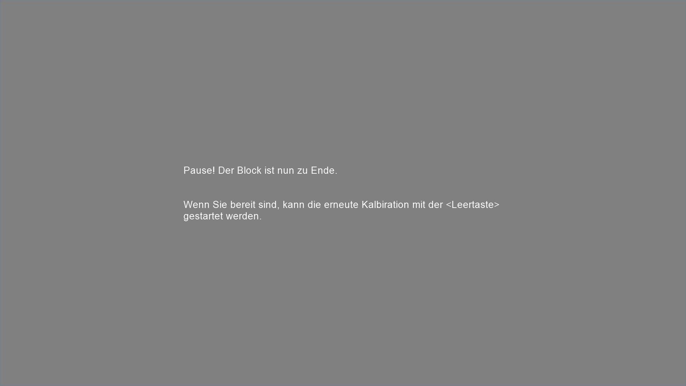
    -   Trialcounter beachten
        -   96 ist der letzte Trial in Block 1
        -   192  ist der letzte Trial in Block 2
        -   288 ist der letzte Trial in Block 3
        -   384 ist der letzte Trial im Block 4
    ```
> trialcounter:   1
> trialcounter:   2
> trialcounter:   3
> trialcounter:   4
> trialcounter:   ...
```
-   Erneut [kalibrieren](#kalibrierung)
    -   auch Autothreshold neu bestimmen

## Nach dem Experiment
-   Kontrollieren, ob die Daten transferiert wurden
    -   Im Ordner "../data/raw/" liegen für jeden Proband 5 Dateien
        -   eine *.csv*-Datei mit den Reaktionszeiten
        -   für jeden Block eine *.EDF*-Datei für die Augenbewegungen
    -   *.csv*-Dateinen sollten ähnlich groß sein, und die *.EDF*-Dateien auch
    - Wenn nicht: siehe [hier](#manuellerdatentransfer)
    
## Probleme und deren Bewältigung

### Datenverlust {#datenverlust}
Datenverlust ist quasi **nicht** möglich. Die Daten werden fortlaufend aufgezeichnet, selbst wenn der Experiment-PC unmittelbar ausgeht, sollten die Daten weiterhin vorhanden sein, solange der Rechner danach wieder normal hochfährt.

### Fehler Datentransfer
Die Daten können auch manuell transferiert werden. Dazu sind allerdings Administratorrechte nötig, 

### Eyetracker neustarten {#eyetrackerneustart}
FOLGT

### Experiment neustarten {#experimentneustart}
Das Experiment kann jederzeit an jedem beliebigen Block neugestartet werden. Dazu trägt man im ersten Dialogfenster unter *block* den Block ein, andem das Experiment wieder starten soll (siehe [Probandennummer eintragen](#probandennummer)).  
Bei einem Absturz oder einer Unterbrechung **immer mit dem nächsten Block beginnen**.

### Experimennt abbrechen

Das Experiment kann jederzeit mit der Taste *Q* abgebrochen werden. Alle Daten bis zum Abbruch bleiben erhalten (siehe [Datenverlust](#datenverlust)).


<a rel="license" href="http://creativecommons.org/licenses/by-sa/4.0/"></a><br />Dieses Werk ist lizenziert unter einer <a rel="license" href="http://creativecommons.org/licenses/by-sa/4.0/">Creative Commons Namensnennung - Weitergabe unter gleichen Bedingungen 4.0 International Lizenz</a>.